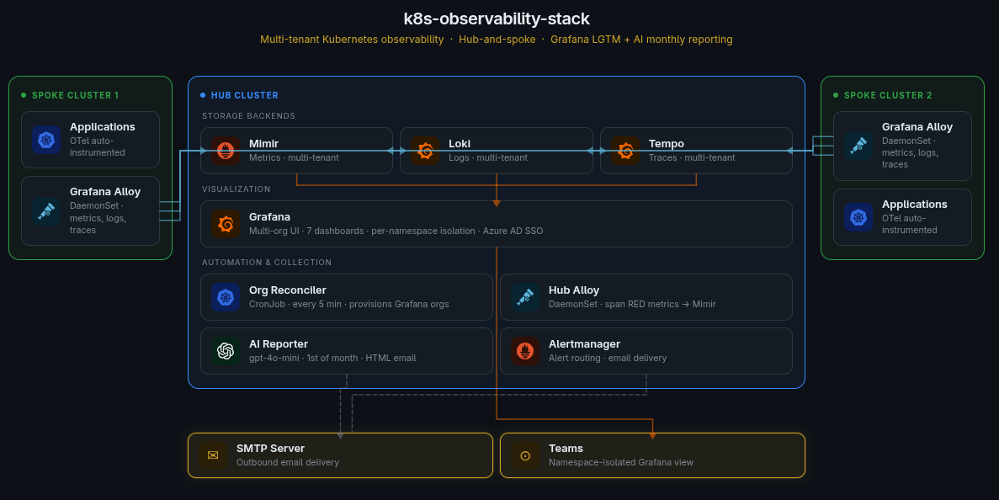
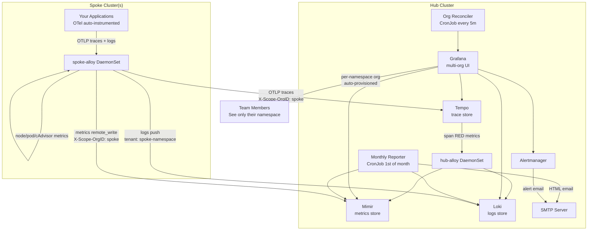

# k8s-observability-stack

A production-grade, multi-tenant Kubernetes observability stack built on the [Grafana LGTM](https://grafana.com/go/webinar/getting-started-with-grafana-lgtm-stack/) stack (Loki · Grafana · Tempo · Mimir) with full metrics → logs → traces correlation, per-namespace Grafana organizations, and automated monthly reporting.



---

## What you get

- **Full observability** — metrics, logs, and distributed traces collected across all clusters
- **Hub-and-spoke topology** — one hub cluster hosts the storage backends; spoke clusters forward all telemetry over HTTPS
- **Multi-tenant Grafana** — each Kubernetes namespace gets its own isolated Grafana organization automatically, with its own datasources scoped to that namespace's data
- **One-click log ↔ trace correlation** — click any log line to jump to the full trace in Tempo; click any span to see matching logs
- **7 pre-built dashboards** — cluster overview, nodes, pods, containers, node exporter, Loki logs, and a dynamic trace+log explorer
- **Automated alerting** — Grafana unified alerting rules for node health, pod health, and monitoring stack self-health, delivered via email
- **AI-powered monthly report** — an agentic reporter (OpenAI gpt-4o-mini + tool calling) autonomously queries metrics and logs, writes an HTML report with per-namespace analysis, and emails it to every team on the 1st of each month

---

## Architecture



### Key design decisions

| Decision | Why |
|----------|-----|
| **Hub collects spoke data** | No cross-cluster kubeconfig — spokes push over public HTTPS endpoints |
| **Loki multi-tenancy per namespace** | `{cluster}-{namespace}` tenant ID = hard isolation; teams can't query other namespaces |
| **Mimir multi-tenancy per cluster** | Metrics for each cluster are stored under a separate tenant, queried together via tenant federation |
| **Org reconciler instead of static config** | New namespaces get a Grafana org automatically within 5 minutes — no manual provisioning |
| **Span RED metrics via hub-alloy** | Tempo can't add `X-Scope-OrgID` headers; hub-alloy acts as a proxy to stamp the correct tenant |

---

## Hub components

| Component | Helm Chart | Version | Purpose |
|-----------|-----------|---------|---------|
| Mimir | `grafana/mimir-distributed` | ≥ 5.5.0 | Long-term metrics storage (multi-tenant) |
| Loki | `grafana/loki` | ≥ 6.x | Log aggregation (multi-tenant, TSDB + S3) |
| Tempo | `grafana/tempo` | ≥ 1.x | Distributed trace storage (multi-tenant) |
| Grafana | `grafana/grafana` | ≥ 11.x | Visualization + per-namespace org management |
| Alertmanager | `prometheus-community/alertmanager` | ≥ 0.x | Alert routing and email delivery |
| OTel Operator | `open-telemetry/opentelemetry-operator` | ≥ 0.x | Auto-instrumentation CRDs for spoke apps |
| hub-alloy | Custom (this repo) | 1.0.0 | Hub DaemonSet — scrapes hub cluster + receives spoke span metrics |
| grafana-org-reconciler | Custom (this repo) | 0.1.0 | Creates per-namespace Grafana orgs every 5 minutes |
| grafana-monthly-reporter | Custom (this repo) | 0.1.0 | AI-driven agentic reporter (gpt-4o-mini + tool calling) — emails monthly HTML report with narrative analysis to each org |
| Dashboards | ConfigMaps (this repo) | — | 7 pre-built Grafana dashboards |

---

## Spoke components

| Component | Helm Chart | Version | Purpose |
|-----------|-----------|---------|---------|
| spoke-alloy | `grafana/alloy` 0.11.0 (wrapped, this repo) | 0.1.0 | Collects metrics/logs/traces, forwards to hub |
| OTel Instrumentation CR | Custom YAML (this repo) | — | Zero-code auto-instrumentation per namespace |

---

## Multi-tenant Grafana org model

```
Grafana (hub cluster)
├── Org 1 (Main)
│   ├── All dashboards (including infra-only ones)
│   └── Datasources: all clusters federated
├── hub-monitoring (auto-created)
│   ├── Dashboards: Dynamic Explorer, K8s Container, Loki Overview
│   └── Datasources: Mimir tenant=hub, Loki tenant=hub-monitoring
├── hub-my-app (auto-created)
│   ├── Same 3 dashboards
│   └── Datasources: Mimir tenant=hub, Loki tenant=hub-my-app
└── spoke-1-their-app (auto-created)
    ├── Same 3 dashboards
    └── Datasources: Mimir tenant=spoke-1, Loki tenant=spoke-1-their-app
```

The **Org Reconciler** CronJob runs every 5 minutes and:
1. Discovers namespaces from the hub cluster (kubectl) and spoke clusters (Mimir label values)
2. Creates a Grafana org per namespace if it does not exist
3. Provisions 4 datasources per org (Mimir, Loki, Tempo scoped to that cluster; Mimir Hub for span metrics)
4. Clones 3 approved dashboards from Org 1
5. Removes any infra-only dashboards from per-namespace orgs

---

## Monthly Automated Report

On the 1st of every month at 08:00 UTC, an AI-driven agentic reporter (OpenAI gpt-4o-mini with tool calling) queries Mimir and Loki for the previous calendar month and emails a professional HTML report to every user in every Grafana org.

**How it works:** The LLM is given 5 tools — `list_grafana_orgs`, `list_all_grafana_users`, `query_mimir`, `query_loki`, and `send_report` — and an instruction prompt. It decides what to query for each namespace, interprets the results, writes the HTML, and delivers it. No templating, no hard-coded metric list: the agent drives the entire workflow.

**What the report covers:**
- Traffic: total requests, total errors, error rate (%), p95 latency
- Resources: average CPU (cores), average RAM (GB)
- Logs: total log lines, log volume (GB)
- Status badge: Healthy (<1% errors) / Warning (1–5%) / Critical (>5%) / Unknown (no trace data)
- Per-namespace narrative: 2–3 sentence analysis written by the LLM

**Requirements:** An OpenAI API key stored in a Kubernetes secret (`monthly-reporter-credentials`, key `OPENAI_API_KEY`). Uses `gpt-4o-mini` — costs pennies per run for typical cluster sizes.


---

## Prerequisites

Before deploying the hub stack, ensure the following are installed on the hub cluster:

| Requirement | Notes |
|-------------|-------|
| Kubernetes 1.25+ | Tested on 1.28+ |
| `cert-manager` | For automatic TLS certificates |
| `ingress-nginx` | For HTTP(S) ingress |
| `external-dns` (optional) | For automatic DNS record management |
| S3-compatible storage | MinIO, AWS S3, Wasabi, etc. — create buckets before deploying |
| PostgreSQL 14+ | For Grafana backend (SQLite works for testing) |

For each spoke cluster: the OTel Operator must be installed if you want auto-instrumentation.

---

## Installation — Hub Stack

> Install in this order. Each component depends on the previous.

```bash
NAMESPACE=monitoring
kubectl create namespace $NAMESPACE

# 1. Secrets (create BEFORE installing charts)
kubectl create secret generic monitoring-mimir-s3    -n $NAMESPACE \
  --from-literal=S3_ENDPOINT=<YOUR_S3_ENDPOINT> \
  --from-literal=S3_ACCESS_KEY=<YOUR_ACCESS_KEY> \
  --from-literal=S3_SECRET_KEY=<YOUR_SECRET_KEY>

kubectl create secret generic monitoring-loki-s3     -n $NAMESPACE \
  --from-literal=S3_ENDPOINT=<YOUR_S3_ENDPOINT> \
  --from-literal=S3_ACCESS_KEY=<YOUR_ACCESS_KEY> \
  --from-literal=S3_SECRET_KEY=<YOUR_SECRET_KEY>

kubectl create secret generic monitoring-tempo-s3    -n $NAMESPACE \
  --from-literal=S3_ENDPOINT=<YOUR_S3_ENDPOINT> \
  --from-literal=S3_ACCESS_KEY=<YOUR_ACCESS_KEY> \
  --from-literal=S3_SECRET_KEY=<YOUR_SECRET_KEY>

kubectl create secret generic grafana-admin-secret   -n $NAMESPACE \
  --from-literal=admin-user=admin \
  --from-literal=admin-password=<STRONG_PASSWORD>

kubectl create secret generic monitoring-grafana-secret -n $NAMESPACE \
  --from-literal=DB_HOST=<POSTGRES_HOST> \
  --from-literal=DB_NAME=grafana \
  --from-literal=DB_USER=grafana \
  --from-literal=DB_PASSWORD=<POSTGRES_PASSWORD> \
  --from-literal=AZURE_CLIENT_ID=<AZURE_CLIENT_ID> \
  --from-literal=AZURE_CLIENT_SECRET=<AZURE_CLIENT_SECRET> \
  --from-literal=AZURE_TENANT_ID=<AZURE_TENANT_ID>

kubectl create secret generic monitoring-alertmanager-credentials -n $NAMESPACE \
  --from-literal=SMTP_PASSWORD=<YOUR_SMTP_PASSWORD>

kubectl create secret generic monthly-reporter-credentials -n $NAMESPACE \
  --from-literal=OPENAI_API_KEY=<YOUR_OPENAI_API_KEY>

# 2. Storage backends
helm repo add grafana https://grafana.github.io/helm-charts && helm repo update

helm upgrade --install mimir grafana/mimir-distributed \
  -n $NAMESPACE -f hub/mimir/values.yaml

helm upgrade --install loki grafana/loki \
  -n $NAMESPACE -f hub/loki/values.yaml

helm upgrade --install tempo grafana/tempo \
  -n $NAMESPACE -f hub/tempo/values.yaml

# 3. Alertmanager
helm repo add prometheus-community https://prometheus-community.github.io/helm-charts
helm upgrade --install alertmanager prometheus-community/alertmanager \
  -n $NAMESPACE -f hub/alertmanager/values.yaml

# 4. OTel Operator (for hub cluster auto-instrumentation)
helm repo add open-telemetry https://open-telemetry.github.io/opentelemetry-helm-charts
helm upgrade --install otel-operator open-telemetry/opentelemetry-operator \
  -n $NAMESPACE -f hub/otel-operator/values.yaml

# 5. Grafana
helm upgrade --install grafana grafana/grafana \
  -n $NAMESPACE -f hub/grafana/values.yaml

# 6. Hub Alloy (must come after Mimir/Loki/Tempo are ready)
helm upgrade --install hub-alloy hub/hub-alloy \
  -n $NAMESPACE

# 7. Dashboards (apply ConfigMaps — picked up by Grafana sidecar)
kubectl apply -f hub/dashboards/ -n $NAMESPACE

# 8. Org Reconciler
helm upgrade --install grafana-org-reconciler hub/grafana-org-reconciler \
  -n $NAMESPACE

# 9. Monthly Reporter
helm upgrade --install grafana-monthly-reporter hub/grafana-monthly-reporter \
  -n $NAMESPACE
```

---

## Installation — Spoke Cluster

Run on each spoke cluster (after hub is running):

```bash
# 1. Install spoke Alloy
helm repo add grafana https://grafana.github.io/helm-charts && helm repo update
helm dependency update spoke/
helm upgrade --install spoke-alloy spoke/ \
  -n monitoring --create-namespace \
  -f spoke/values.yaml

# 2. Install OTel Operator (for auto-instrumentation)
helm repo add open-telemetry https://open-telemetry.github.io/opentelemetry-helm-charts
helm upgrade --install otel-operator open-telemetry/opentelemetry-operator \
  -n monitoring \
  --set admissionWebhooks.certManager.enabled=true

# 3. Apply Instrumentation CR to each namespace you want to instrument
# Edit spoke/otel-instrumentation/instrumentation-cr.yaml — set namespace + cluster name
kubectl apply -f spoke/otel-instrumentation/instrumentation-cr.yaml -n <your-namespace>
```

---

## App Integration — What Dev Teams Need To Do

Your app needs three things for full observability:

### 1. Structured JSON logs to stdout

Alloy extracts `trace_id` from log lines and stores it as Loki structured metadata, enabling the log → trace jump in Grafana.

| Language | What to add |
|----------|-------------|
| **.NET / Serilog** | `Serilog.Formatting.Compact` + `Serilog.Enrichers.OpenTelemetry`; set `CompactJsonFormatter` on Console sink; add `WithOpenTelemetryTraceContext` enricher |
| **Node.js (Pino)** | Pino emits JSON by default — inject `trace_id` from `@opentelemetry/api` active span context |
| **Node.js (Winston)** | Custom format that reads `trace.getActiveSpan().spanContext().traceId` |
| **Python (structlog)** | Add an OTel processor that reads `trace.get_current_span().get_span_context()` |
| **Java (Spring Boot)** | `logstash-logback-encoder` + `opentelemetry-logback-mdc` agent bridge |
| **Go (zerolog / zap)** | Inject `span.SpanContext().TraceID().String()` per log line |

**Rules:**
- Log to **stdout only** — Kubernetes captures it and Alloy tails it
- **One JSON object per line** — multi-line stack traces must be wrapped in a string field

### 2. Traces — zero code with OTel Operator

No code changes needed for supported frameworks (ASP.NET Core, Express.js, FastAPI, Spring Boot, etc.).  
The platform team applies an `Instrumentation` CR to your namespace:

```bash
# Platform team runs this — no action needed from dev teams
kubectl apply -f spoke/otel-instrumentation/instrumentation-cr.yaml -n <your-namespace>
```

For unsupported frameworks, manually initialize `TracerProvider`:

```python
# Python example
from opentelemetry.sdk.trace import TracerProvider
from opentelemetry.exporter.otlp.proto.http.trace_exporter import OTLPSpanExporter

provider = TracerProvider()
provider.add_span_processor(
    BatchSpanProcessor(OTLPSpanExporter(endpoint="http://spoke-alloy.monitoring.svc.cluster.local:4318"))
)
```

### 3. Metrics — pod annotations

Annotate your Deployment/Pod so Alloy scrapes your `/metrics` endpoint:

```yaml
metadata:
  annotations:
    prometheus.io/scrape: "true"
    prometheus.io/port:   "8080"    # your metrics port
    prometheus.io/path:   "/metrics"
```

Or create a `ServiceMonitor` CR if you use Prometheus Operator.

---

## Values Reference

| Component | File |
|-----------|------|
| Mimir | [hub/mimir/values.yaml](hub/mimir/values.yaml) |
| Loki | [hub/loki/values.yaml](hub/loki/values.yaml) |
| Tempo | [hub/tempo/values.yaml](hub/tempo/values.yaml) |
| Grafana | [hub/grafana/values.yaml](hub/grafana/values.yaml) |
| Alertmanager | [hub/alertmanager/values.yaml](hub/alertmanager/values.yaml) |
| OTel Operator | [hub/otel-operator/values.yaml](hub/otel-operator/values.yaml) |
| hub-alloy | [hub/hub-alloy/values.yaml](hub/hub-alloy/values.yaml) |
| Org Reconciler | [hub/grafana-org-reconciler/values.yaml](hub/grafana-org-reconciler/values.yaml) |
| Monthly Reporter | [hub/grafana-monthly-reporter/values.yaml](hub/grafana-monthly-reporter/values.yaml) |
| Spoke Alloy | [spoke/values.yaml](spoke/values.yaml) |

---

## License

Apache 2.0 — see [LICENSE](LICENSE).
# k8s-observability-stack
