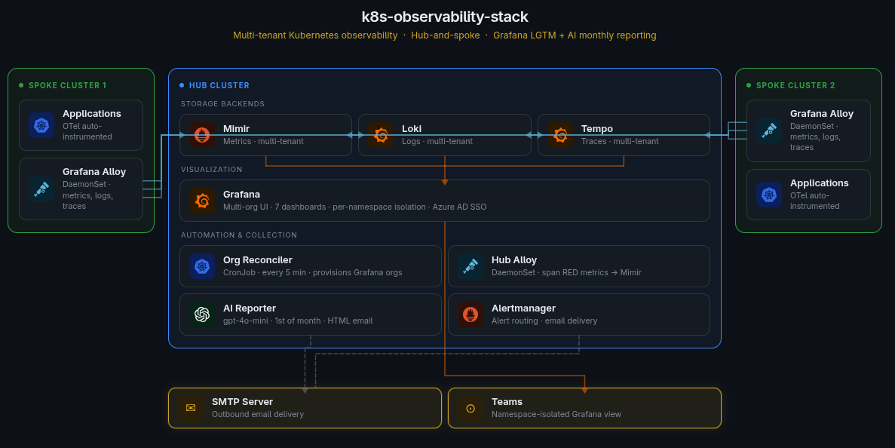

# k8s-observability-stack

A production-grade, multi-tenant Kubernetes observability stack built on the [Grafana LGTM](https://grafana.com/go/webinar/getting-started-with-grafana-lgtm-stack/) stack (Loki · Grafana · Tempo · Mimir) with full metrics → logs → traces correlation, per-namespace Grafana organizations, and automated monthly reporting.



---

## What you get

- **Full observability** — metrics, logs, and distributed traces collected across all clusters
- **Hub-and-spoke topology** — one hub cluster hosts the storage backends; spoke clusters forward all telemetry over HTTPS
- **Multi-tenant Grafana** — each Kubernetes namespace gets its own isolated Grafana organization automatically, with its own datasources scoped to that namespace's data
- **One-click log ↔ trace correlation** — click any log line to jump to the full trace in Tempo; click any span to see matching logs
- **11 pre-built dashboards** — cluster overview, nodes, pods, containers, node exporter, Loki logs, a dynamic trace+log explorer, a Kubernetes fleet overview, a namespace-views dashboard, a RAM/CPU deep-dive, and a Redis overview
- **Node-level certificate expiry watcher** — a zero-RBAC, read-only DaemonSet (`cert-sentinel`) that alerts before an expired kubeadm/kubelet cert silently breaks ArgoCD sync, kubelet status, or ingress backend discovery
- **Optional fixed-org DB dashboards** — a small reconciler (`grafana-db-monitoring-reconciler`) that keeps a hand-picked PostgreSQL/MariaDB dashboard set in sync in their own Grafana org, for teams that want DB-host metrics alongside the rest of the stack
- **Automated alerting** — Grafana unified alerting rules for node health, pod health, and monitoring stack self-health, delivered via email
- **AI-powered monthly report** — an agentic reporter (OpenAI gpt-4o-mini + tool calling) autonomously queries metrics and logs, writes an HTML report with per-namespace analysis, and emails it to every team on the 1st of each month

---

## Architecture

### Key design decisions

| Decision | Why |
|----------|-----|
| **Hub collects spoke data** | No cross-cluster kubeconfig — spokes push over public HTTPS endpoints |
| **Loki multi-tenancy per namespace** | `{cluster}-{namespace}` tenant ID = hard isolation; teams can't query other namespaces |
| **Mimir multi-tenancy per cluster** | Metrics for each cluster are stored under a separate tenant, queried together via tenant federation |
| **Org reconciler instead of static config** | New namespaces get a Grafana org automatically within 30 minutes — no manual provisioning |
| **Span RED metrics via hub-alloy** | Tempo can't add `X-Scope-OrgID` headers; hub-alloy acts as a proxy to stamp the correct tenant |

---

## Hub components

| Component | Helm Chart | Version | Purpose |
|-----------|-----------|---------|---------|
| Mimir | `grafana/mimir-distributed` | ≥ 5.5.0 | Long-term metrics storage (multi-tenant) |
| Loki | `grafana/loki` | ≥ 6.x | Log aggregation (multi-tenant, TSDB + S3) |
| Tempo | `grafana/tempo` | ≥ 1.x | Distributed trace storage (multi-tenant) |
| tempo-otlp-ingress | Custom (this repo) | — | Dedicated Ingress for OTLP gRPC trace ingest from spoke clusters |
| Grafana | `grafana/grafana` | ≥ 11.x | Visualization + per-namespace org management |
| Alertmanager | `prometheus-community/alertmanager` | ≥ 0.x | Alert routing, email delivery, and optional Microsoft Teams webhook |
| OTel Operator | `open-telemetry/opentelemetry-operator` | ≥ 0.x | Auto-instrumentation CRDs for hub and spoke apps |
| hub-alloy | Custom (this repo) | 1.0.0 | Hub DaemonSet — scrapes hub cluster + receives spoke span metrics |
| grafana-org-reconciler | Custom (this repo) | 0.1.0 | Creates per-namespace Grafana orgs and per-org email alerting every 30 minutes |
| grafana-monthly-reporter | Custom (this repo) | 0.1.0 | Deterministic Mimir/Loki scrape + AI-written narrative insights (gpt-4o-mini) — emails monthly HTML report to each org |
| grafana-db-monitoring-reconciler | Custom (this repo) | 0.1.0 | Optional — ensures a fixed "DB-monitoring" org exists and keeps 3 PostgreSQL/MariaDB dashboards synced into it every 30 minutes |
| Dashboards | ConfigMaps (this repo) | — | 11 pre-built Grafana dashboards |

---

## Spoke components

| Component | Helm Chart | Version | Purpose |
|-----------|-----------|---------|---------|
| spoke-alloy | `grafana/alloy` 0.11.0 (wrapped, this repo) | 0.1.0 | Collects metrics/logs/traces, forwards to hub |
| OTel Instrumentation CR | Custom YAML (this repo) | — | Zero-code auto-instrumentation per namespace |

Apps that run directly on the **hub** cluster (rather than a spoke) skip spoke-alloy entirely and point their `Instrumentation` CR straight at hub-alloy's own OTLP endpoint — see [hub/otel-instrumentation/instrumentation-cr.yaml](hub/otel-instrumentation/instrumentation-cr.yaml).

---

## Node-level components (any cluster)

| Component | Helm Chart | Version | Purpose |
|-----------|-----------|---------|---------|
| cert-sentinel | Custom (this repo) | 0.1.2 | Optional — read-only DaemonSet, watches node-local Kubernetes PKI cert expiry (kubeadm certs, kubeconfig client certs, kubelet client/serving certs), alerts via stdout + optional Uptime Kuma push + Telegram |

`cert-sentinel` has **no ServiceAccount, no RBAC, and no Kubernetes API calls at all** — it only reads local host files (read-only hostPath mounts) and reports. It's independent of the hub/spoke topology and can be installed on any cluster (hub, spoke, or neither) on its own:

```bash
helm upgrade --install cert-sentinel cert-sentinel/ \
  -n monitoring --create-namespace \
  --set kuma.enabled=true \
  --set kuma.pushUrl=<YOUR_UPTIME_KUMA_PUSH_URL> \
  --set telegram.enabled=true \
  --set telegram.botToken=<YOUR_TELEGRAM_BOT_TOKEN> \
  --set telegram.chatId=<YOUR_TELEGRAM_CHAT_ID>
```

Both alert sinks are optional and off by default — `kubectl logs` against the DaemonSet works with zero configuration.

---

## Clustering & scaling notes

This stack is designed to run with more than one replica of Alloy per cluster (hub or spoke), so a few things need to line up together — easy to miss if you're only skimming individual values files:

- **Alloy clustering needs to be enabled at three levels, not one.** `alloy.clustering.enabled: true` (top-level Helm value, turns on the Alloy process's `--cluster.enabled` runtime flag) **and** `clustering { enabled = true }` inside each `prometheus.scrape`/`prometheus.operator.servicemonitors` River block (opts that specific scrape job into cluster-wide target sharding) **and**, for hub-alloy specifically, the DaemonSet's `--cluster.discover-peers=provider=k8s namespace=...  label_selector="..."` arg needs its `label_selector` value **double-quoted** — go-discover's parser splits on the first `=`, so an unquoted `key=value` selector silently fails peer discovery and every replica bootstraps as its own isolated 1-node cluster (each one then scrapes and remote-writes the *same* cluster-wide targets, which is both wasteful and a common cause of OOMKills at scale). If only some of these three are set, clustering is either partially inert or fully inert — check all three.
- **hub-alloy's memory limit should be generous** (`8Gi` in this repo's default) once clustering is genuinely sharding real cluster-wide scrape work across replicas, not the smaller limit appropriate for a single low-traffic instance.
- **Mimir's `ingester` runs 5 replicas with `replication_factor: 3`** (up from a single replica at RF=1) so a single ingester restarting doesn't stall ingestion for every tenant — with RF=1, losing the one owning replica for a series blacks out writes for it entirely ("at least 1 live replicas required, could only find 0"); with RF=3 a write only needs quorum (2 of 3) acks. Resources are doubled accordingly (`2Gi` request / `32Gi` limit per replica). Storage is still `emptyDir` (no PVC) — durability now comes from replication across the other replicas rather than from local disk.
- **Mimir's `store_gateway` runs as a single replica by design in this repo** (`replicas: 1`, see `hub/mimir/values.yaml`) with an `8Gi` memory limit. Because it's single-replica, an OOM there breaks *historical* queries for every tenant until it finishes resyncing — if you have many federated tenants at long retention, watch its memory usage and raise the limit (or move to a replicated store-gateway with sharding, which Mimir supports but this repo doesn't configure by default) before it becomes a problem.
- **Mimir's ingester TSDB block-cutting cadence is tuned down from Mimir's stock defaults** (`block_ranges_period: [10m]` vs. the 2h default, `retention_period: 4h` vs. the 13h default) to bound the data-loss window if an ingester pod is lost, and to keep its local disk from filling with blocks already shipped to S3 — `retention_period` should stay comfortably above `store_gateway`'s bucket-sync interval (15m default) so store-gateway has already discovered a block before the ingester drops its local copy.

---

## Multi-tenant Grafana org model

```
Grafana (hub cluster)
├── Org 1 (Main)
│   ├── All dashboards (including infra-only ones)
│   └── Datasources: all clusters federated
├── hub-monitoring (auto-created)
│   ├── Dashboards: Dynamic Explorer, K8s Container, Loki Overview, K8s Overview, K8s Views/Namespaces, K8s RAM/CPU, Redis Overview
│   └── Datasources: Mimir tenant=hub, Loki tenant=hub-monitoring
├── hub-my-app (auto-created)
│   ├── Same 7 dashboards
│   └── Datasources: Mimir tenant=hub, Loki tenant=hub-my-app
└── spoke-1-their-app (auto-created)
    ├── Same 7 dashboards
    └── Datasources: Mimir tenant=spoke-1, Loki tenant=spoke-1-their-app
```

The **Org Reconciler** CronJob runs every 30 minutes and:
1. Discovers namespaces from the hub cluster (kubectl) and spoke clusters (Mimir label values)
2. Creates a Grafana org per namespace if it does not exist
3. Provisions 4 datasources per org (Mimir, Loki, Tempo scoped to that cluster; Mimir Hub for span metrics)
4. Clones the 7 approved dashboards (`ALLOWED_CLONE_UIDS` in its script) from Org 1 into per-org `Explorer`/`Logs` folders, pinning each dashboard's `namespace` variable to that org's own namespace (Mimir has no per-namespace tenant boundary, unlike Loki, so without this every Mimir-backed panel would default to showing the whole cluster)
5. Removes any infra-only dashboards from per-namespace orgs
6. Creates/updates an `email-team` contact point from the org's current member list and points the org's default notification policy at it — so per-namespace alert routing stays in sync with who's actually in that Grafana org, no manual contact-point maintenance required

---

## Monthly Automated Report

On the 1st of every month at 08:00 UTC, the reporter deterministically scrapes Mimir and Loki for the previous calendar month, renders a professional HTML report, and emails it to every user in every Grafana org.

**How it works:** Target discovery (which cluster/namespace pairs to report on) comes from listing Grafana orgs and splitting each org name against a known cluster-tenant list — no LLM involved in deciding what to query. A fixed, proven set of PromQL/LogQL queries (pods, restarts, CPU/RAM reserved vs. peak usage, ingress request count, log volume, error/warn log counts) is run per namespace. All numbers in the report are computed by this fixed pipeline and never touched by AI. Only the narrative commentary is AI-written: the pre-computed metrics are handed to gpt-4o-mini with instructions to identify operationally meaningful patterns (error spikes, restart storms, capacity headroom) and return 2–4 short bullet points per cluster — the model cannot recompute or restate a number, only comment on ones it's given.

**What the report covers:**
- Per-cluster summary: namespace count, total requests, total pod restarts, total error logs
- Per-namespace table: pods, requests, restarts (highlighted if elevated), CPU/RAM reserved vs. peak usage, error/warn/total log lines and volume
- Cluster-level AI narrative: 2–4 bullet points per cluster highlighting only what's operationally notable in that period's data

**Test mode:** the CronJob's script supports `TEST_CLUSTER`, `TEST_NS_LIST`, `TEST_NS_FILTER`, `TEST_NS_LIMIT`, `TEST_RECIPIENTS`, and `TEST_PERIOD_START`/`TEST_PERIOD_END`/`TEST_PERIOD_LABEL` env vars for running a scoped one-off report (e.g. via `kubectl create job --from=cronjob/grafana-monthly-reporter` + `kubectl set env`) without waiting for the real schedule or emailing real recipients.

**Requirements:** An OpenAI API key stored in a Kubernetes secret (`monthly-reporter-credentials`, key `OPENAI_API_KEY`). Uses `gpt-4o-mini` by default (configurable via `openaiModel`) — costs pennies per run for typical cluster sizes. If the OpenAI call fails or times out, the report still sends on schedule with the data tables intact and no AI commentary section.


---

## Prerequisites

Before deploying the hub stack, ensure the following are installed on the hub cluster:

| Requirement | Notes |
|-------------|-------|
| Kubernetes 1.25+ | Tested on 1.28+ |
| `cert-manager` | For automatic TLS certificates |
| `ingress-nginx` | For HTTP(S) ingress |
| `external-dns` (optional) | For automatic DNS record management |
| S3-compatible storage | MinIO, AWS S3, Wasabi, etc. — create buckets before deploying |
| PostgreSQL 14+ | For Grafana backend (SQLite works for testing) |
| A Prometheus Operator install (optional) | Only if you want `ServiceMonitor`-based scraping in addition to pod-annotation scraping |

For each spoke cluster: the OTel Operator must be installed if you want auto-instrumentation. Apps hosted directly on the hub cluster can be auto-instrumented too — the hub stack installs its own OTel Operator (step 4 below).

**If you plan to use the optional `grafana-db-monitoring-reconciler`:** you'll also need a read-only Postgres monitoring role on each PostgreSQL host (e.g. a member of `pg_monitor`/`pg_read_all_stats` — never superuser), the `pg_stat_statements` extension enabled for the "Slowest Queries" panel, and an existing Prometheus (or two, if your PostgreSQL and MariaDB fleets are scraped by separate Prometheus instances) already collecting `node_exporter`/`postgres_exporter`/`mysqld_exporter` metrics — this component only manages the Grafana org/dashboards/datasources, it doesn't deploy any exporters itself.

---

## Installation — Hub Stack

> Install in this order. Each component depends on the previous.

```bash
NAMESPACE=monitoring
kubectl create namespace $NAMESPACE

# 1. Secrets (create BEFORE installing charts)
kubectl create secret generic monitoring-mimir-s3    -n $NAMESPACE \
  --from-literal=S3_ENDPOINT=<YOUR_S3_ENDPOINT> \
  --from-literal=S3_ACCESS_KEY=<YOUR_ACCESS_KEY> \
  --from-literal=S3_SECRET_KEY=<YOUR_SECRET_KEY>

kubectl create secret generic monitoring-loki-s3     -n $NAMESPACE \
  --from-literal=S3_ENDPOINT=<YOUR_S3_ENDPOINT> \
  --from-literal=S3_ACCESS_KEY=<YOUR_ACCESS_KEY> \
  --from-literal=S3_SECRET_KEY=<YOUR_SECRET_KEY>

kubectl create secret generic monitoring-tempo-s3    -n $NAMESPACE \
  --from-literal=S3_ENDPOINT=<YOUR_S3_ENDPOINT> \
  --from-literal=S3_ACCESS_KEY=<YOUR_ACCESS_KEY> \
  --from-literal=S3_SECRET_KEY=<YOUR_SECRET_KEY>

kubectl create secret generic grafana-admin-secret   -n $NAMESPACE \
  --from-literal=admin-user=admin \
  --from-literal=admin-password=<STRONG_PASSWORD>

kubectl create secret generic monitoring-grafana-secret -n $NAMESPACE \
  --from-literal=DB_HOST=<POSTGRES_HOST> \
  --from-literal=DB_NAME=grafana \
  --from-literal=DB_USER=grafana \
  --from-literal=DB_PASSWORD=<POSTGRES_PASSWORD> \
  --from-literal=AZURE_CLIENT_ID=<AZURE_CLIENT_ID> \
  --from-literal=AZURE_CLIENT_SECRET=<AZURE_CLIENT_SECRET> \
  --from-literal=AZURE_TENANT_ID=<AZURE_TENANT_ID>

kubectl create secret generic monitoring-alertmanager-credentials -n $NAMESPACE \
  --from-literal=SMTP_PASSWORD=<YOUR_SMTP_PASSWORD> \
  --from-literal=teams_webhook_url=<YOUR_TEAMS_INCOMING_WEBHOOK_URL>   # optional — Microsoft Teams alert delivery

kubectl create secret generic monthly-reporter-credentials -n $NAMESPACE \
  --from-literal=OPENAI_API_KEY=<YOUR_OPENAI_API_KEY>

# 2. Storage backends
helm repo add grafana https://grafana.github.io/helm-charts && helm repo update

helm upgrade --install mimir grafana/mimir-distributed \
  -n $NAMESPACE -f hub/mimir/values.yaml

helm upgrade --install loki grafana/loki \
  -n $NAMESPACE -f hub/loki/values.yaml

helm upgrade --install tempo grafana/tempo \
  -n $NAMESPACE -f hub/tempo/values.yaml

# 2b. Tempo OTLP ingress (dedicated gRPC ingress for spoke clusters pushing traces
# over the public endpoint — see the NOTE in hub/tempo/values.yaml for why this is separate)
kubectl apply -f hub/tempo-otlp-ingress/ingress.yaml -n $NAMESPACE

# 3. Alertmanager
helm repo add prometheus-community https://prometheus-community.github.io/helm-charts
helm upgrade --install alertmanager prometheus-community/alertmanager \
  -n $NAMESPACE -f hub/alertmanager/values.yaml

# 4. OTel Operator (for hub cluster auto-instrumentation)
helm repo add open-telemetry https://open-telemetry.github.io/opentelemetry-helm-charts
helm upgrade --install otel-operator open-telemetry/opentelemetry-operator \
  -n $NAMESPACE -f hub/otel-operator/values.yaml

# 5. Grafana
helm upgrade --install grafana grafana/grafana \
  -n $NAMESPACE -f hub/grafana/values.yaml

# 6. Hub Alloy (must come after Mimir/Loki/Tempo are ready)
helm upgrade --install hub-alloy hub/hub-alloy \
  -n $NAMESPACE

# 7. Dashboards (apply ConfigMaps — picked up by Grafana sidecar)
kubectl apply -f hub/dashboards/ -n $NAMESPACE

# 8. Org Reconciler
helm upgrade --install grafana-org-reconciler hub/grafana-org-reconciler \
  -n $NAMESPACE

# 9. Monthly Reporter
helm upgrade --install grafana-monthly-reporter hub/grafana-monthly-reporter \
  -n $NAMESPACE

# 10. (Optional) DB Monitoring Reconciler — fixed-org PostgreSQL/MariaDB dashboards.
# Only needed if you want the psql-cluster / MariaDB dashboards; skip otherwise.
# Requires a read-only Postgres monitoring role (e.g. a member of
# pg_monitor/pg_read_all_stats — not superuser) for POSTGRES_EXPORTER_USER/PASSWORD,
# and the datasource URLs configured in hub/grafana/values.yaml's "DB-monitoring org"
# section (placeholders like <YOUR_PSQL_HOST_1>, <YOUR_PROMETHEUS_HOST>) filled in
# BEFORE step 5 re-runs, since Grafana's datasource provisioning happens at that step.
kubectl create secret generic monitoring-postgres-exporter-secret -n $NAMESPACE \
  --from-literal=POSTGRES_EXPORTER_USER=<YOUR_READONLY_MONITORING_USER> \
  --from-literal=POSTGRES_EXPORTER_PASSWORD=<YOUR_READONLY_MONITORING_PASSWORD>

helm upgrade --install grafana-db-monitoring-reconciler hub/grafana-db-monitoring-reconciler \
  -n $NAMESPACE

# 11. (Optional) cert-sentinel — node-local cert expiry watcher, independent of the
# rest of the stack. See "Node-level components" above for details/flags.
helm upgrade --install cert-sentinel cert-sentinel/ \
  -n $NAMESPACE
```

---

## Installation — Spoke Cluster

Run on each spoke cluster (after hub is running):

```bash
# 1. Install spoke Alloy
helm repo add grafana https://grafana.github.io/helm-charts && helm repo update
helm dependency update spoke/
helm upgrade --install spoke-alloy spoke/ \
  -n monitoring --create-namespace \
  -f spoke/values.yaml

# 2. Install OTel Operator (for auto-instrumentation)
helm repo add open-telemetry https://open-telemetry.github.io/opentelemetry-helm-charts
helm upgrade --install otel-operator open-telemetry/opentelemetry-operator \
  -n monitoring \
  --set admissionWebhooks.certManager.enabled=true

# 3. Apply Instrumentation CR to each namespace you want to instrument
# Edit spoke/otel-instrumentation/instrumentation-cr.yaml — set namespace + cluster name
kubectl apply -f spoke/otel-instrumentation/instrumentation-cr.yaml -n <your-namespace>
```

---

## App Integration — What Dev Teams Need To Do

Your app needs three things for full observability:

### 1. Structured JSON logs to stdout

Alloy extracts `trace_id` from log lines and stores it as Loki structured metadata, enabling the log → trace jump in Grafana.

| Language | What to add |
|----------|-------------|
| **.NET / Serilog** | `Serilog.Formatting.Compact` + `Serilog.Enrichers.OpenTelemetry`; set `CompactJsonFormatter` on Console sink; add `WithOpenTelemetryTraceContext` enricher |
| **Node.js (Pino)** | Pino emits JSON by default — inject `trace_id` from `@opentelemetry/api` active span context |
| **Node.js (Winston)** | Custom format that reads `trace.getActiveSpan().spanContext().traceId` |
| **Python (structlog)** | Add an OTel processor that reads `trace.get_current_span().get_span_context()` |
| **Java (Spring Boot)** | `logstash-logback-encoder` + `opentelemetry-logback-mdc` agent bridge |
| **Go (zerolog / zap)** | Inject `span.SpanContext().TraceID().String()` per log line |

**Rules:**
- Log to **stdout only** — Kubernetes captures it and Alloy tails it
- **One JSON object per line** — multi-line stack traces must be wrapped in a string field

### 2. Traces — zero code with OTel Operator

No code changes needed for supported frameworks (ASP.NET Core, Express.js, FastAPI, Spring Boot, etc.).  
The platform team applies an `Instrumentation` CR to your namespace:

```bash
# Platform team runs this — no action needed from dev teams
kubectl apply -f spoke/otel-instrumentation/instrumentation-cr.yaml -n <your-namespace>
```

For unsupported frameworks, manually initialize `TracerProvider`:

```python
# Python example
from opentelemetry.sdk.trace import TracerProvider
from opentelemetry.exporter.otlp.proto.http.trace_exporter import OTLPSpanExporter

provider = TracerProvider()
provider.add_span_processor(
    BatchSpanProcessor(OTLPSpanExporter(endpoint="http://spoke-alloy.monitoring.svc.cluster.local:4318"))
)
```

### 3. Metrics — pod annotations

Annotate your Deployment/Pod so Alloy scrapes your `/metrics` endpoint:

```yaml
metadata:
  annotations:
    prometheus.io/scrape: "true"
    prometheus.io/port:   "8080"    # your metrics port
    prometheus.io/path:   "/metrics"
```

Or create a `ServiceMonitor` CR if you use Prometheus Operator.

---

## Values Reference

| Component | File |
|-----------|------|
| Mimir | [hub/mimir/values.yaml](hub/mimir/values.yaml) |
| Loki | [hub/loki/values.yaml](hub/loki/values.yaml) |
| Tempo | [hub/tempo/values.yaml](hub/tempo/values.yaml) |
| Tempo OTLP Ingress | [hub/tempo-otlp-ingress/ingress.yaml](hub/tempo-otlp-ingress/ingress.yaml) |
| Grafana | [hub/grafana/values.yaml](hub/grafana/values.yaml) |
| Alertmanager | [hub/alertmanager/values.yaml](hub/alertmanager/values.yaml) |
| OTel Operator | [hub/otel-operator/values.yaml](hub/otel-operator/values.yaml) |
| Hub OTel Instrumentation CR | [hub/otel-instrumentation/instrumentation-cr.yaml](hub/otel-instrumentation/instrumentation-cr.yaml) |
| hub-alloy | [hub/hub-alloy/values.yaml](hub/hub-alloy/values.yaml) |
| Org Reconciler | [hub/grafana-org-reconciler/values.yaml](hub/grafana-org-reconciler/values.yaml) |
| Monthly Reporter | [hub/grafana-monthly-reporter/values.yaml](hub/grafana-monthly-reporter/values.yaml) |
| DB Monitoring Reconciler (optional) | [hub/grafana-db-monitoring-reconciler/values.yaml](hub/grafana-db-monitoring-reconciler/values.yaml) |
| cert-sentinel (optional, any cluster) | [cert-sentinel/values.yaml](cert-sentinel/values.yaml) |
| Spoke Alloy | [spoke/values.yaml](spoke/values.yaml) |

---

## License

Apache 2.0 — see [LICENSE](LICENSE).
# k8s-observability-stack
